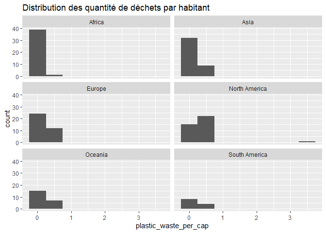
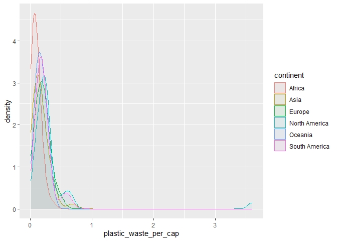
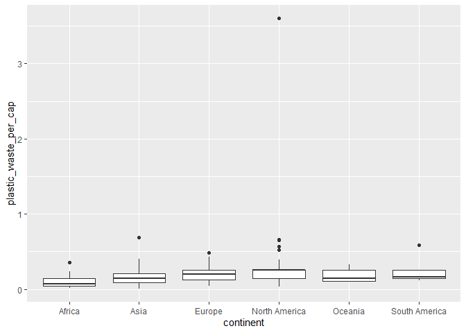
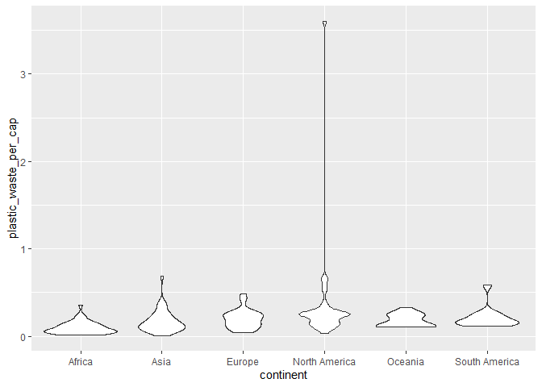
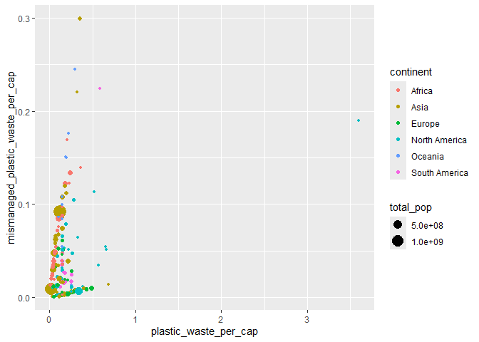
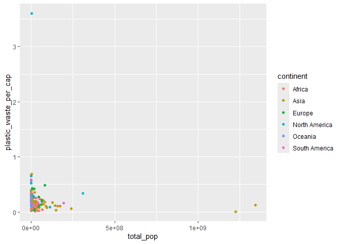
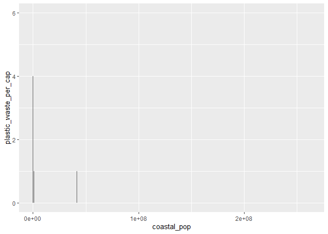

Lab 02 - Plastic waste
================
Noémie Roy
La date

## Chargement des packages et des données

``` r
library(tidyverse) 
```

``` r
plastic_waste <- read_csv("data/plastic-waste.csv")
```

Commençons par filtrer les données pour retirer le point représenté par
Trinité et Tobago (TTO) qui est un outlier.

``` r
plastic_waste %>%
  filter(plastic_waste_per_cap < 3.5)
```

    ## # A tibble: 188 × 10
    ##    code  entity              continent    year gdp_per_cap plastic_waste_per_cap
    ##    <chr> <chr>               <chr>       <dbl>       <dbl>                 <dbl>
    ##  1 ALB   Albania             Europe       2010       9927.                 0.069
    ##  2 DZA   Algeria             Africa       2010      12871.                 0.144
    ##  3 AGO   Angola              Africa       2010       5898.                 0.062
    ##  4 AIA   Anguilla            North Amer…  2010         NA                  0.252
    ##  5 ATG   Antigua and Barbuda North Amer…  2010      19213.                 0.66 
    ##  6 ARG   Argentina           South Amer…  2010      18712.                 0.183
    ##  7 ABW   Aruba               North Amer…  2010         NA                  0.252
    ##  8 AUS   Australia           Oceania      2010      41464.                 0.112
    ##  9 BHS   Bahamas             North Amer…  2010      29222.                 0.39 
    ## 10 BHR   Bahrain             Asia         2010      40571.                 0.132
    ## # ℹ 178 more rows
    ## # ℹ 4 more variables: mismanaged_plastic_waste_per_cap <dbl>,
    ## #   mismanaged_plastic_waste <dbl>, coastal_pop <dbl>, total_pop <dbl>

## Exercices

### Exercise 1

``` r
#
ggplot(plastic_waste, aes(x = plastic_waste_per_cap)) +
  geom_histogram(binwidth = 0.5, 
                 shape = 1) +
  labs(
    x = "plastic_waste_per_cap",
    y = "count",
    title = "Distribution des quantité de déchets par habitant"
  ) +
  facet_wrap(~ continent, nrow = 3)
```

    ## Warning in geom_histogram(binwidth = 0.5, shape = 1): Ignoring unknown
    ## parameters: `shape`

    ## Warning: Removed 51 rows containing non-finite outside the scale range
    ## (`stat_bin()`).

<!-- -->

### Exercise 2

``` r
#
ggplot(plastic_waste, 
       aes(x = plastic_waste_per_cap, fill = continent, color = continent)) + 
  geom_density(adjust = 2,
               alpha = 0.05)
```

    ## Warning: Removed 51 rows containing non-finite outside the scale range
    ## (`stat_density()`).

<!-- -->

Réponse à la question…

### Exercise 3

Boxplot:

``` r
# 
ggplot(plastic_waste, 
       aes(x = continent, y = plastic_waste_per_cap)) + 
  geom_boxplot()
```

    ## Warning: Removed 51 rows containing non-finite outside the scale range
    ## (`stat_boxplot()`).

<!-- -->

Violin plot:

``` r
#
ggplot(plastic_waste, 
       aes(x = continent, y = plastic_waste_per_cap)) + 
  geom_violin()
```

    ## Warning: Removed 51 rows containing non-finite outside the scale range
    ## (`stat_ydensity()`).

<!-- -->

Réponse à la question…

### Exercise 4

``` r
#
ggplot(plastic_waste, 
       aes(x = plastic_waste_per_cap, y = mismanaged_plastic_waste_per_cap, color = continent, size = total_pop)) +
  geom_point()
```

    ## Warning: Removed 61 rows containing missing values or values outside the scale range
    ## (`geom_point()`).

<!-- -->

Réponse à la question…

### Exercise 5

``` r
#
ggplot(plastic_waste, 
       aes(x = total_pop, y = plastic_waste_per_cap, 
           fill = continent, color = continent)) +
  geom_point()
```

    ## Warning: Removed 61 rows containing missing values or values outside the scale range
    ## (`geom_point()`).

<!-- -->

``` r
#
ggplot(plastic_waste, aes(x = coastal_pop)) +
  geom_histogram(binwidth = 10000) +
  labs(x = "coastal_pop",
       y = "plastic_waste_per_cap")
```

    ## Warning: Removed 51 rows containing non-finite outside the scale range
    ## (`stat_bin()`).

<!-- -->

Réponse à la question…

## Conclusion

Recréez la visualisation:

``` r
# plastic_waste_coastal <- plastic_waste %>% mutate(coastal_pop_prop = coastal_pop / total_pop) %>% filter(plastic_waste_per_cap < 3)
```
